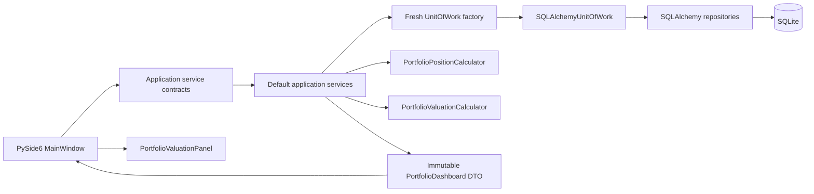

# Sprint 1.6 — Desktop Alpha Vertical Slice

| Field | Value |
| --- | --- |
| Status | Completed |
| Branch | `sprint-1.6` |
| Milestone | Milestone B completion; handoff to Milestone C — Desktop Alpha Readiness |
| Completion date | 2026-07-20 |

The completion date reflects the local Sprint 1.6 commit history and repository
context. The validation evidence in this document is local; it is not a claim about a
CI run.

## Objective and Accepted User Journey

Sprint 1.6 replaced the static demonstration dashboard with a persisted desktop
workflow. The accepted journey is:

```text
Open application
→ create or select a Portfolio
→ create an Asset
→ record a BUY
→ observe the missing-price state
→ record a manual market price
→ view the position and its per-currency valuation
→ record a partial SELL
→ view realized and unrealized P&L
→ delete the SELL transaction
→ close and reopen the application
→ recover persisted data and recalculated results
```

Every business-data step in the real vertical-slice test crosses the application
service and persistence boundaries. Restart verification constructs a second
`DatabaseManager`, `Container`, and `MainWindow` against the same isolated temporary
SQLite database.

## Delivered Capabilities

### Portfolio Management

- Create a Portfolio and list or select persisted Portfolios.
- Use a UUID as Portfolio identity.
- Show truthful first-launch, no-selection, empty-transaction, and empty-valuation
  states without fabricating rows.
- Allow different Portfolios to have the same display name; a name is not identity.

### Asset Management

- Create globally reusable Assets and list the persisted Asset registry.
- Normalize an Asset symbol by trimming and uppercasing it, and normalize its name by
  trimming it.
- Allow duplicate normalized symbols with distinct UUIDs.
- Keep a newly created Asset out of a Portfolio until a transaction associates that
  Asset with the Portfolio.

### Transaction Management

- Record BUY and SELL transactions with exact quantity, unit price, commission, tax,
  and a UTC trade timestamp.
- Show persisted transaction history.
- Identify and delete a transaction by UUID.
- Use the `PortfolioDetails` returned by successful deletion to update transaction
  presentation before recalculating the dashboard.

### Manual Price Management

- Append immutable price records for an Asset UUID.
- Preserve an exact `Decimal` price and an observed UTC timestamp.
- Derive price currency from the persisted Asset rather than accepting it as a
  separate UI input.
- Accept zero as a valid market price and reject negative prices.

### Position and Valuation Presentation

- Show calculated quantity, moving weighted average cost, cost basis, market price,
  market value, realized P&L, unrealized P&L, total P&L, and price timestamp.
- Use the latest persisted price selected by the query boundary.
- Present a separate summary for each currency.
- Retain closed positions and value them without requiring a current price.
- Render immutable application result DTOs; the UI does not reproduce the domain
  formulas.

### Persistence

- Persist through SQLite, SQLAlchemy repositories, and `SQLAlchemyUnitOfWork`.
- Create one fresh Unit of Work for each application service operation.
- Commit successful writes in application services; read operations do not commit.
- Restore Portfolios, Assets, transactions, prices, UUID identities, positions, and
  currency summaries after application reconstruction.

## Architecture and Dependency Flow

`build_container` constructs the immutable desktop `Container` and wires each
application contract to its default implementation. Together they are the desktop
composition root. The UI receives service contracts from the `Container`; it does not
construct or reach through infrastructure objects.



For commands and ordinary queries, the runtime boundary is:

```text
MainWindow
→ application service contract
→ default application service
→ fresh UnitOfWork
→ SQLAlchemy repositories
→ SQLite
→ immutable application result DTO
→ MainWindow presentation
```

For calculated valuation, the flow is:

```text
MainWindow
→ PortfolioDashboardQueryService
→ DefaultPortfolioDashboardQueryService
→ fresh UnitOfWork and persisted latest-price selection
→ PortfolioPositionCalculator
→ PortfolioValuationCalculator
→ immutable PortfolioDashboard
→ MainWindow
→ PortfolioValuationPanel
```

The UI does not import or access repositories, SQLAlchemy `Session` objects, Units of
Work, ORM models, or SQLAlchemy. It performs no financial calculations and makes no
direct latest-price query. The dashboard query service owns latest-price selection,
position calculation, valuation orchestration, and mapping to the dashboard DTO.

## Application Contracts

### Commands

| Command | Implemented purpose |
| --- | --- |
| `CreatePortfolioCommand` | Create a named Portfolio |
| `CreateAssetCommand` | Create a globally reusable Asset |
| `BuyAssetCommand` | Record a UUID-addressed Asset purchase |
| `SellAssetCommand` | Record a UUID-addressed Asset sale |
| `DeleteTransactionCommand` | Remove an owned transaction by UUID |
| `RecordMarketPriceCommand` | Append an exact timestamped price for an Asset UUID |

### Queries

| Query | Implemented purpose |
| --- | --- |
| `ListPortfoliosQuery` | List persisted Portfolio summaries |
| `GetPortfolioQuery` | Load one Portfolio and its Assets and transactions |
| `ListAssetsQuery` | List a page of persisted Assets |
| `GetLatestMarketPriceQuery` | Read the deterministic latest price for one Asset |
| `GetPortfolioDashboardQuery` | Load and calculate one complete Portfolio dashboard |

`MainWindow` does not use `GetLatestMarketPriceQuery` to build valuation. That query is
available through the market-price application service, while the dashboard query
service performs its own repository-backed price selection as part of one calculated
read.

### Result DTOs

- `PortfolioSummary` supplies persisted Portfolio selector data.
- `PortfolioDetails` supplies one Portfolio, its member Assets, and transaction
  history.
- `AssetView` supplies descriptive registry data.
- `TransactionView` supplies exact persisted transaction data.
- `MarketPriceView` supplies one persisted price and its Asset association.
- `ValuedAssetPositionView` supplies descriptive and calculated position fields.
- `CurrencyValuationView` supplies one exact currency bucket.
- `PortfolioDashboard` combines `PortfolioDetails`, valued positions, and currency
  summaries.

These are immutable application results. UI widgets map them to display strings without
changing their values.

## Identity Rules

| Concept | Persistent identity |
| --- | --- |
| Portfolio | UUID |
| Asset | UUID |
| Transaction | UUID |
| Market-price record | Its own UUID, associated to an Asset UUID |

Duplicate Portfolio names may coexist. Duplicate normalized Asset symbols may also
coexist, including within different currencies. Names, symbols, combo-box indices, and
table row numbers are presentation data, not persistent identities. Transactions,
prices, and valuation positions join by Asset UUID, so equal symbols cannot overwrite
or merge one another.

## Decimal and Time Rules

- Monetary and quantity values use `Decimal` from dialog parsing through commands,
  domain calculation, persistence mapping, result DTOs, and UI formatting.
- Application and UI workflows do not convert financial values to `float`.
- The UI does not round, quantize, or recalculate financial results.
- Numeric input rejects non-finite values, including NaN and Infinity.
- Trade and observed-at timestamps are timezone-aware UTC.
- Qt datetime conversion starts from integer epoch milliseconds and preserves the
  remaining milliseconds; it does not use a floating-point epoch conversion.
- Display formatting does not mutate DTO values.

## Position and Valuation Semantics

`PortfolioPositionCalculator` processes transactions in Portfolio order and uses moving
weighted average cost.

For a BUY:

```text
acquisition_cost =
    quantity × unit_price
    + commission
    + tax

new_quantity = current_quantity + quantity
new_cost_basis = current_cost_basis + acquisition_cost
new_average_cost = new_cost_basis / new_quantity
```

For a SELL:

```text
net_proceeds =
    quantity × unit_price
    - commission
    - tax

disposed_cost = quantity × current_average_cost
realized_change = net_proceeds - disposed_cost
```

SELL charges therefore reduce realized P&L. They do not change the average cost of the
remaining units. A full close resets current quantity, average cost, and cost basis to
exact zero while preserving cumulative realized P&L. A later BUY begins a new
acquisition-cost cycle; prior cumulative realized P&L remains.

Open-position valuation uses:

```text
market_value = quantity × latest_market_price
unrealized_pnl = market_value - cost_basis
total_pnl = realized_pnl + unrealized_pnl
```

Closed positions remain in dashboard output with no market price, zero market value,
zero unrealized P&L, and total P&L equal to cumulative realized P&L. Unsupported
dividends and corporate actions are not calculated. An oversell or sell-before-buy
history raises `InsufficientPositionError` during position calculation. None of these
formulas is implemented in the UI.

## Market-Price and Missing-Price Policy

- A price belongs to an Asset UUID.
- The latest record is selected by `observed_at` descending, then price-record UUID
  descending as a deterministic tie-break.
- Price currency is derived from the persisted Asset.
- Zero is a valid price; a negative price is invalid.
- Every open position requires a persisted latest price.
- A missing open-position price raises `MissingMarketPriceError`.
- There is no fallback to transaction price, average cost, or zero.
- The dashboard query is atomic: it returns a complete dashboard or raises; it does not
  return a partial dashboard.
- Closed positions require no market price or observed timestamp.
- The expected missing-price state appears inline, clears stale valuation rows, and
  leaves transaction history visible.

## Multi-Currency Boundary

Valuation is separated by `Currency`. Each `CurrencyValuationView` contains its own cost
basis, market value, realized P&L, unrealized P&L, and total P&L. Currency summaries
follow the domain's first-position encounter order.

There is no FX rate contract, FX conversion, cross-currency aggregation, or
Portfolio-wide grand total. A Portfolio's base currency is metadata and is not used to
convert values without an explicit FX contract.

## UI Workflow and Refresh Matrix

| Event | PortfolioDetails refresh | Dashboard refresh |
| --- | ---: | ---: |
| Portfolio selection | Yes | Yes |
| Portfolio creation | Yes | Yes |
| Asset creation | No | No |
| BUY success | Yes | Yes |
| SELL success | Yes | Yes |
| Transaction deletion | Returned details used | Yes |
| Manual price success | No | Yes when Portfolio selected |
| Manual valuation refresh | No | Yes |
| Cancellation/failure | No success refresh | No |

Asset creation refreshes only the global Asset registry. BUY and SELL success reload
Portfolio details and then refresh valuation. A successful deletion avoids a redundant
details query by applying the returned `PortfolioDetails`. Failed dashboard queries
clear stale position and currency valuation data before showing the error state.

## Error Behavior

| Error or failure | Desktop behavior |
| --- | --- |
| `ApplicationError` | Show a bounded workflow or load error; do not report success |
| `RepositoryError` | Show a safe persistence/load error; do not repair data automatically |
| Ordinary validation failure | Reject invalid dialog or command input and preserve the prior successful state |
| `MissingMarketPriceError` | Show the expected inline record-price state without a blocking valuation dialog |
| `InvalidMarketPriceError` | Clear stale valuation and report that the selected Portfolio cannot be valued |
| `PositionAssetNotFoundError` | Clear stale valuation and report inconsistent persisted valuation state |
| `InsufficientPositionError` | Clear stale valuation and report the invalid transaction history |
| `UnsupportedTransactionTypeError` | Clear stale valuation and report the unsupported history |
| `TransactionNotFoundError` | Propagate through the domain-error deletion path and show deletion failure |

For valuation-only failures, the existing Portfolio, Asset registry, and transaction
history remain visible where safe, while stale calculated values are removed.
Expected missing-price setup is inline and non-blocking. No path attempts an automatic
persistence repair. Unexpected failures are logged and presented as bounded,
user-facing messages without exposing internal details.

## Test Evidence

The final Sprint 1.6 local validation baseline is:

| Scope | Result |
| --- | ---: |
| Full pytest suite | 408 passed |
| UI suite | 74 passed |
| Application suite | 123 passed |
| Persistence integration | 67 passed |
| Repository / UnitOfWork | 31 passed |
| Database lifecycle | 9 passed |
| Position and valuation calculators | 63 passed |
| Migrations | 5 passed |
| Cross-layer workflows | 11 passed |
| Desktop Alpha presentation acceptance | 4 passed |
| Desktop Alpha real vertical-slice integration | 4 passed |

Additional quality evidence:

- Relevant Sprint strict MyPy: zero errors across 75 files.
- Broad MyPy: one known legacy error in `app/repositories/base.py`.
- Ruff lint: passed.
- Ruff formatting: passed across 132 files.
- Architecture and safety scans: passed, including import-boundary, no-demo-data,
  no-float, direct-SQL production, private-mutation, no-direct-price-read UI,
  no-financial-formula UI, no-cross-currency-total, and background-work checks.
- Production and development database hashes, sizes, and modification timestamps were
  unchanged.

### Test-Layer Distinction

Presentation acceptance tests use stateful fake application services. They validate UI
orchestration, action state, call budgets, cancellation and failure atomicity, refresh
behavior, and DTO-to-widget presentation. They return configured financial DTO values
and do not calculate those values.

Real vertical-slice integration tests use a real `MainWindow`, `Container`, default
application services, `SQLAlchemyUnitOfWork`, SQLAlchemy repositories, and temporary
SQLite databases. They cover the complete workflow and restart persistence, plus
multiple currencies, duplicate symbols isolated by UUID, a closed position without a
price, reopening a persisted position, and isolation between two independently
constructed databases and Containers.

## Non-Goals and Deferred Work

Sprint 1.6 does not include:

- External market-price providers.
- Automatic refresh.
- FX conversion or cross-currency totals.
- Charts or performance history.
- Dividends or corporate-action UI.
- Benchmarks.
- XIRR or CAGR.
- Snapshots.
- Cloud synchronization.
- Mobile clients.
- Packaging.
- A backup and restore user workflow.
- Diagnostics export.
- Global crash handling.
- A release installer.

## Next Milestone

Milestone C — Desktop Alpha Readiness is the next milestone. Its expected work is:

- Packaging.
- Clean-install verification.
- First-run database creation.
- Migration smoke testing.
- Backup and restore.
- Global error handling.
- Diagnostics export.
- Settings.
- UI responsiveness review.
- User acceptance testing.
- Release notes.
- Prerelease version `v0.1.0-alpha.1`.

These are planned readiness activities and are not marked complete by Sprint 1.6.

## Sprint 1.6 Commit Ledger

1. `0b18b62` — `feat(application): add asset and transaction input contracts`
2. `72d0dd7` — `feat(application): add market price and dashboard query contracts`
3. `534208e` — `feat(persistence): implement latest asset price queries`
4. `45451d4` — `feat(application): implement asset and market price workflows`
5. `2ee3995` — `feat(application): implement calculated portfolio dashboard`
6. `2a9b9b7` — `feat(composition): wire portfolio services into desktop bootstrap`
7. `a065cad` — `feat(ui): add portfolio and asset management workflows`
8. `cb48be2` — `feat(ui): add buy sell and transaction management`
9. `2c106ff` — `feat(ui): connect dashboard to portfolio valuation`
10. `c576b11` — `test(ui): validate desktop alpha presentation workflows`
11. `224c602` — `test(integration): validate desktop alpha vertical slice`
12. Documentation commit (this document; SHA assigned when committed) —
    `docs: document Sprint 1.6 alpha architecture`
